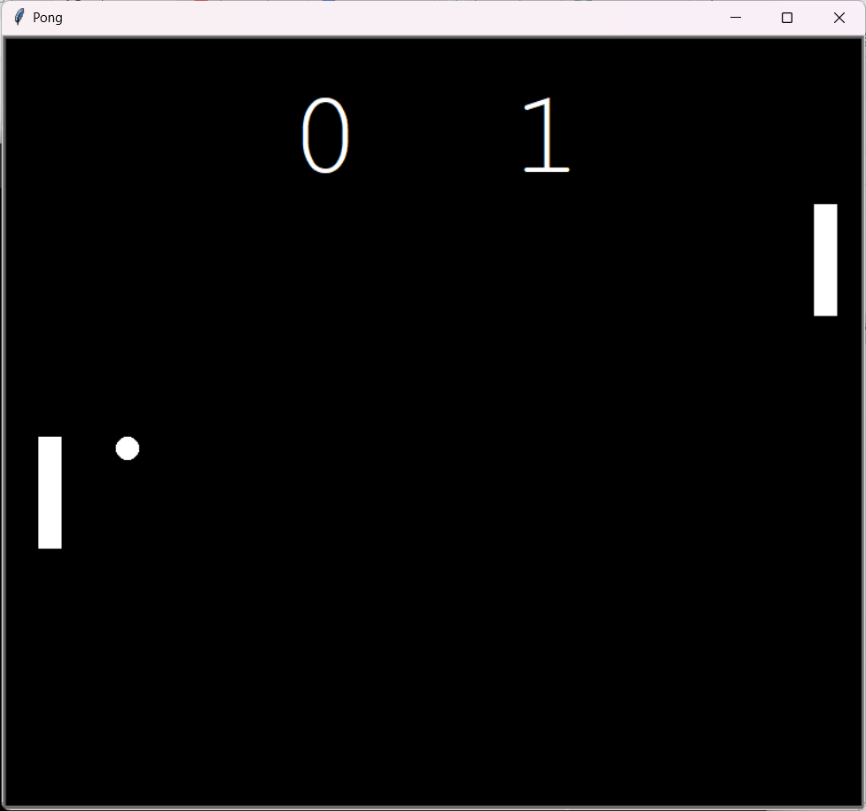

# Pong Game

This is a simple implementation of the classic Pong game using Python's Turtle module. 

## How to Play

- Use the up and down arrow keys to control the right paddle.
- Use the 'w' and 's' keys to control the left paddle.
- The game ends when one player scores 5 points.

## Requirements

- Python 3.x
- Turtle module

## Installation

1. Clone this repository to your local machine.
2. Ensure you have Python installed on your system.
3. Run the `pong_game.py` file using Python.

## Screenshots

## Download

You can download the executable file [here](https://drive.google.com/file/d/10eh4ED7j7JVFp1L5aORESpjs7hTeMJcr/view?usp=drive_link).

Have fun playing Pong!
